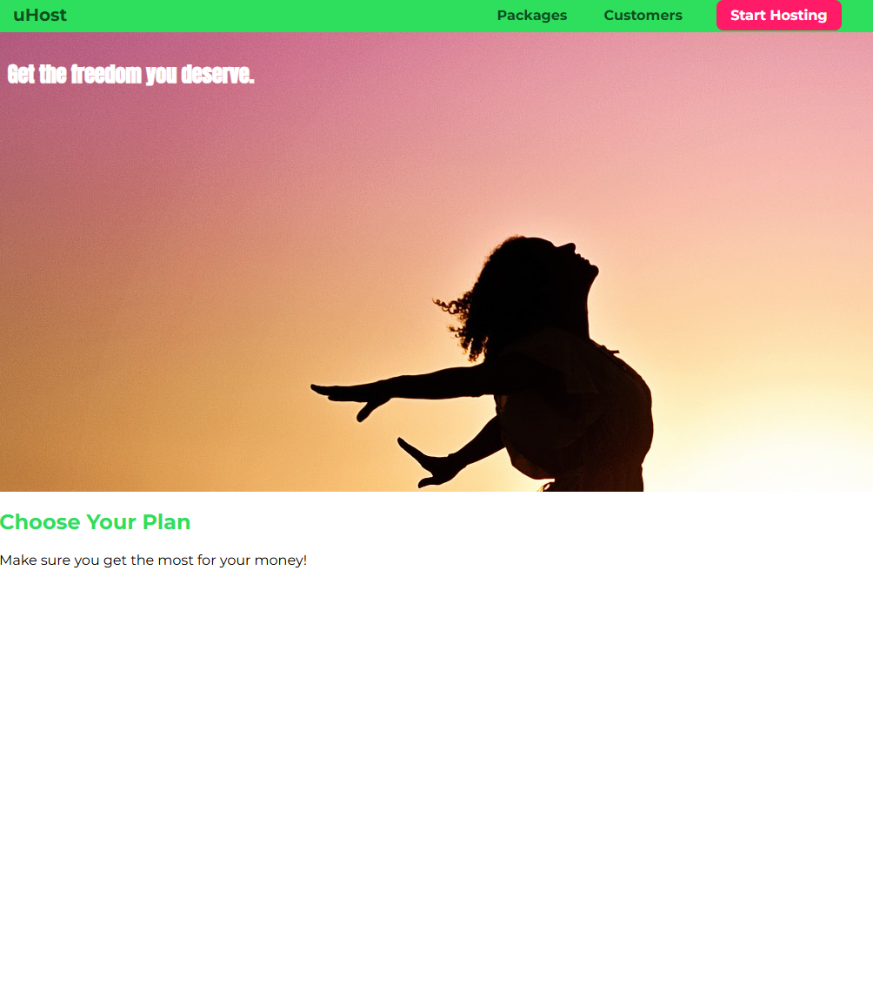

# uHost Landing Page – Intro to CSS Project

This uHost landing page is a beginner-friendly project I built to learn and practice HTML and CSS. It focuses on basic layout structure, styling text and elements, and applying custom fonts and colors. It’s a simple web page with two sections: a product overview and a pricing plan section.
  

## 🎯 Learning Goals
- Understand how to structure a webpage using HTML
- Learn how to use CSS to style sections, headings, and backgrounds
- Experiment with Google Fonts and font families
- Practice using CSS classes, IDs, and selectors
- Apply custom colors and spacing to improve design
 

## 🔧 Technologies Used
- HTML5 for content structure
- CSS3 for styling and layout
- Google Fonts for custom typography
 

## 🖥️ Preview

 

## 📜 License
This project is open-source. Feel free to fork, modify, and expand upon it!
  

---

✨ Happy coding! 🚀
